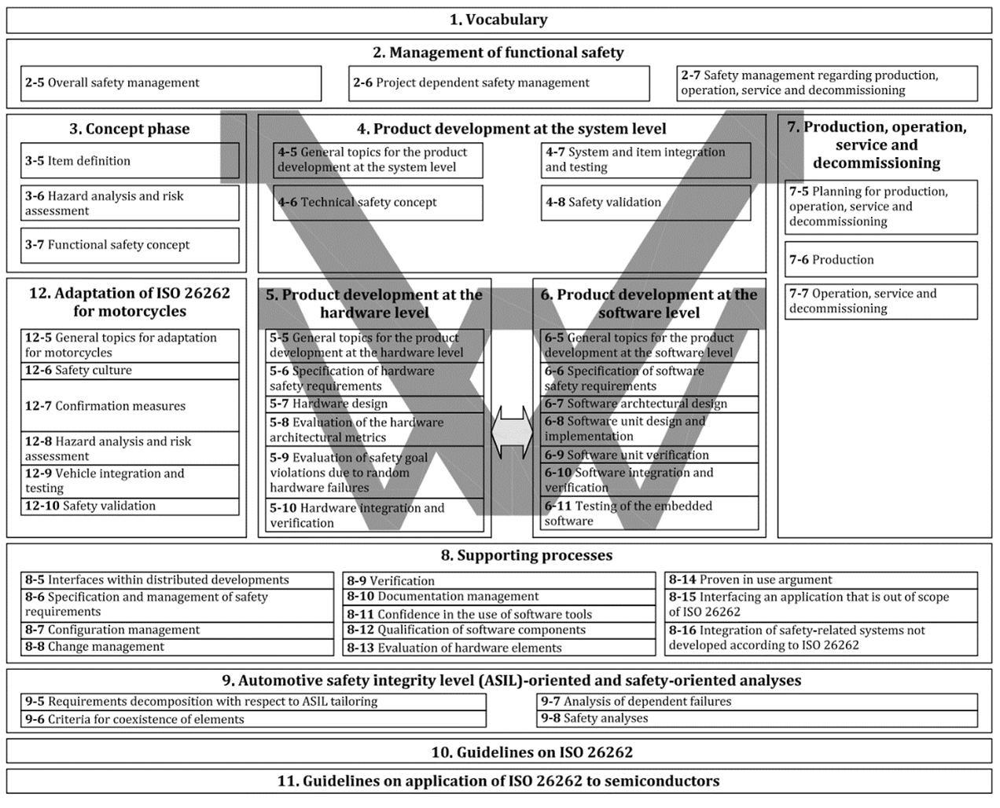

# ISO 26262-5: A Practical Guide for Hardware Safety in Automotive Systems

## List of Abbreviations
| Abbreviation | Full Term                                |
|--------------|------------------------------------------|
| ISO          | International Organization for Standardization |
| ISO 26262    | ISO 26262 Standard                      |
| ASIL         | Automotive Safety Integrity Level       |
| HARA         | Hazard Analysis and Risk Assessment     |
| SPFM         | Single-Point Fault Metric               |
| LFM          | Latent Fault Metric                     |
| FIT          | Failures In Time                        |
| V-Model      | V-Model Development Process             |
| FTA          | Fault Tree Analysis                     |
| FMEA         | Failure Modes and Effects Analysis      |
| ADAS         | Advanced Driver Assistance System       |
| QM           | Quality Management                      |

## Glossary of Terms
## Glossary

| Term                     | Definition                                                                                                                                               |
|---------------------------|-----------------------------------------------------------------------------------------------------------------------------------------------------------|
| **ISO 26262**            | An international standard for functional safety in the automotive industry, ensuring electronic and electrical systems in vehicles meet rigorous safety requirements. |
| **ASIL**                 | Classification system in ISO 26262 that assesses the risk levels for defects in vehicle systems, ranging from QM (Quality Management) to ASIL D (highest safety level). |
| **HARA**                 | Process for identifying, assessing, and assigning risks to safety objectives in vehicle system development.                                               |
| **SPFM**                 | A metric used to evaluate the likelihood that a single fault directly leads to a hazardous situation.                                                     |
| **LFM**                  | A metric used to assess the presence of faults that are initially undetected but could lead to danger if combined with additional faults.                  |
| **FIT-Rate**             | Measurement of failure rate, used in ISO 26262 to determine reliability by calculating the number of failures per billion hours.                           |
| **V-Model**              | A development model in ISO 26262 for defining requirements (left side) and corresponding validation (right side) to ensure system safety at all stages.     |
| **Safety Mechanisms**    | Methods implemented to detect, control, and prevent system errors, ensuring continued safe operation of the vehicle.                                       |
| **Functional Safety Requirements** | Requirements that specify the necessary safety functions a system must perform to prevent hazardous situations.                                   |
| **Technical Safety Requirements**  | Detailed safety specifications derived from functional safety requirements, addressing how a system should meet safety goals.                     |
| **FTA**                  | A deductive method for analyzing potential failure events by breaking down possible causes in a hierarchical structure.                                   |
| **FMEA**                 | An inductive approach for analyzing failure impacts on components to prevent safety risks in the system.                                                  |
| **Diagnostic Coverage**  | The extent to which safety mechanisms can detect and manage faults within a system, ensuring functionality under various conditions.                       |
| **ADAS**                 | Vehicle systems designed to aid drivers by providing real-time support such as collision warnings, automated braking, and lane assistance.                 |

# ISO 26262-5 Accessible Guide

## 1. Introduction
This document serves as an accessible guide to the ISO 26262-5 standard. While the ISO standard itself is dense and technical, this guide distills the essential points, making the information more accessible and easier to understand. Key concepts, definitions, and processes have been extracted and clarified, allowing readers to grasp the foundational elements of ISO 26262-5 without needing to dive into the full standard. By combining theoretical explanations with practical examples, this document enables users to gain a clear and comprehensive understanding of the hardware safety requirements for electrical and electronic systems in automotive applications.

## 2. Scope
This document focuses on ISO 26262-5, which addresses hardware safety requirements for automotive systems. It highlights the necessary safety assessments, design considerations, and validation steps essential for ensuring the reliability of critical components. Unlike the original ISO standard, this version distills the content into key topics and provides practical examples. Aiming to simplify the understanding and implementation of hardware safety in modern vehicles.

## 3. Structure
This document begins with a general overview of ISO 26262, providing context on the standard’s purpose and importance in ensuring the functional safety of electrical and electronic systems in the automotive industry. Following this, it introduces Automotive Safety Integrity Levels (ASILs), which are essential for classifying and managing risks within these systems.

Next, the document covers ISO 26262-5, detailing its specific scope and objectives focused on hardware-level safety. It then delves into key aspects of hardware development, beginning with hardware design requirements, which outline how to ensure that hardware components meet the necessary safety standards.

The following section addresses the evaluation of hardware architectural metrics. Afterward, the document explores methods for hardware verification and validation, essential for confirming that all safety requirements are met through severe testing.

To provide practical insight, the structure concludes with a step-by-step example illustrating how to develop a radar sensor according to ISO 26262-5. This example demonstrates the application of safety goals, hardware specifications, fault detection mechanisms, and validation testing, helping readers understand how ISO 26262-5 requirements translate into real-world tasks, ultimately supporting the creation of safer automotive systems.

## 4. ISO 26262

### 4.1 ISO 26262 Overview
The ISO 26262 standard is an international standard that has been specially developed for the automotive industry, with the aim of guaranteeing the safety of all electronic systems in a vehicle. The standard was introduced in 2011 by the International Organization for Standardization (ISO), which was necessary due to the increasing complexity of vehicles.

Nowadays, cars are becoming more and more dependent on electronic systems such as driver assistance systems, power brakes, power steering, and drive systems. These developments offer many advantages, but they also increase the risk of possible dangerous malfunctions in these electrical systems. ISO 26262 provides a structured approach to identify and manage these risks, better ensuring the safety of the driver and other road users.

The standard arose from the need to improve the reliability and safety of vehicles. In the past, cars were mainly mechanical; nowadays, almost everything in a car depends on electronics and software. A malfunction in one of these systems can have major consequences, such as uncontrollable acceleration or failing brakes. It was therefore essential to develop a standard that helps manufacturers design, test, and validate safe electrical systems.

---

### 4.2 ISO 26262 Classification
ISO 26262 is made up of 12 parts, each of which deals with a specific phase or aspect of the development process. Each part helps to ensure the safety of vehicles in a structured way, from initial design to scrapping.

#### 4.2.1 Part 1: Vocabulary
The first part of ISO 26262 provides a comprehensive glossary of definitions of terms used in the standard. The aim is to create a clear language within the automotive industry that everyone, from designers to suppliers, can understand. This improves communication and prevents misunderstandings during the implementation of the standard.

#### 4.2.2 Part 2: Functional Safety Management
This section focuses on how functional safety is managed within the development process of a system. It mentions how organizations can follow a structural approach to ensure safety, with attention to planning, risk management, and the allocation of responsible persons or parties. One of these requirements is the appointment of a functional safety manager, who is responsible for overseeing the safety processes and maintaining the necessary documentation. This documentation must be audited by an independent party to comply with the standard.

#### 4.2.3 Part 3: Concept Phase
Part 3 is about designing and developing vehicles and systems. In this phase of the project, the focus is on determining what exactly needs to be developed. An important part of this is the **Hazard Analysis and Risk Assessment (HARA)**. During this analysis, possible hazards due to system failures are identified and assessed. Based on these findings, safety objectives are formulated, with each objective being assigned an ASIL. This ASIL classification ranges from A (low risk) to D (high risk), depending on how serious the consequences of a failure could be.

#### 4.2.4 Part 4: System-Level Product Development
This part focuses on designing safe systems by defining safety requirements. It builds on the functional safety goals previously defined in Part 3. Based on these, specific technical requirements are defined. Safety mechanisms are also developed that can detect and resolve errors in the system. This process ensures that both software and hardware meet the stated safety goals so that the entire system can operate reliably and safely.

#### 4.2.5 Part 5: Hardware-Level Product Development
Part 5 focuses specifically on hardware system development. It discusses the requirements that hardware components must meet to ensure system safety. This part covers topics such as defining hardware safety requirements, hardware design, and assessing measurable requirements. It also looks at the risk of unexpected hardware failures and how these can affect the functional safety of the system.

#### 4.2.6 Part 6: Software-Level Product Development
This part covers the development requirements for software. As with hardware in Part 5, the software requirements are developed based on the safety requirements. It focuses on designing reliable and safe software through rigorous testing, validation, and verification. Integrating safety mechanisms to identify and control software errors is also an important part of this section.

#### 4.2.7 Part 7: Production, Operation, Maintenance, and Dismantling
This part discusses how the functional safety of a system is ensured during production and throughout the entire life cycle of the vehicle, from use and maintenance to dismantling. Planning the production process and identifying possible defects is also of great importance. In addition, regular evaluations and checks are necessary to ensure functional safety.

#### 4.2.8 Part 8: Supporting Processes
Part 8 covers various supporting processes that are important for the safe development of a system according to ISO 26262. Topics such as verification and validation, and risk management are covered. This part helps to control unexpected situations during the development process.

#### 4.2.9 Part 9: ASIL-Oriented and Safety-Oriented Analyses
This part discusses the different methods and techniques that can be used to perform safety analyses during the production process. Safety analyses are necessary to gain insight into the possible failures that can occur during the use of the system and the consequences of these failures. Part 9 provides guidelines for performing these analyses alongside the development process so that safety problems are recognized and solved in a timely manner.

#### 4.2.10 Part 10: Guidelines for the Use of the Standard
Part 10 provides an overview of the application of the standard and gives developers an insight into the key processes and procedures. This part provides guidelines for the application of the procedures discussed earlier. It provides information on how the ISO 26262 standard can be applied in the development process of a vehicle.

#### 4.2.11 Part 11: Application of ISO 26262 to Semiconductors
Since semiconductors have different requirements than other systems, this part is intended for the application of ISO 26262 to semiconductors. It focuses on the specific safety requirements relevant to semiconductor components and their function within automotive electrical and electronic systems.

#### 4.2.12 Part 12: Specific Requirements for Motorcycles
This last part of ISO 26262 describes the safety requirements for motorcycles, as these differ from the requirements for other vehicles. This part contains guidelines and procedures for developing safe electronic and electrical systems specifically for motorcycles.

Together, these parts cover the entire life cycle of a product, from initial design to production, maintenance, and even disassembly.

---

## 4.3 ISO 26262 V-Model
An important part of ISO 26262 is the V-model, which is widely used in the development of systems that are of great importance for safety. This model offers a structured approach where design and verification go hand in hand.

The V-model gets its name from the shape the process takes. The left part of the V describes the phases in which the system requirements are established. Here, the safety goals are set and converted into technical requirements for the different parts of the vehicle, such as system, hardware, and software.

The right side of the V focuses on the verification and validation stages. Each step in the design process on the left side has a corresponding test or verification step on the right side. This means that once a part of the system has been designed, it is tested on the other side of the V to ensure that it meets the stated requirements.

For example, once the functional safety requirements for a steering assistance system have been defined (left side of the V), they are tested and validated later in the process through simulations, tests, and analyses (right side of the V).

The V-model ensures that every aspect of the system is thoroughly tested and validated, preventing safety issues. This makes it a valuable tool within ISO 26262 for the development of complex electronic and software-controlled vehicle systems.

    

Figure 3: The V-model used in ISO 26262 for system development and validation

---

## 5. Automotive Safety Integrity Level (ASIL)

### 5.1 Determining an ASIL
ASIL (Automotive Safety Integrity Level) is a classification system within the ISO 26262 standard for safety in the automotive industry. It assesses the risks of defects in electronic systems in vehicles. ASIL determines how strict the safety measures must be based on the severity of possible accidents, how often dangerous situations can occur, and how well they can be controlled. As a result, ASIL helps manufacturers to take the right safety measures and thus reduce the risk of accidents.

To assign an ASIL value to a system, three factors must be taken into account:

#### Severity:
Severity refers to how severe the injuries or damage would be if a hazardous event occurred. Suppose the braking system of a car fails. If this happens on the highway at high speed, it could be life-threatening for both the occupants and other road users. The severity would therefore be extremely high because it could lead to serious injuries or fatal accidents. 
There are four categories:
- **S0**: No injuries
- **S1**: Mild to moderate injuries
- **S2**: Serious to life-threatening injuries (survival likely)
- **S3**: Life-threatening (survival uncertain) to fatal injuries

#### Exposure:
Exposure looks at how often a situation occurs in which that hazard could occur. For example, suppose the brake system only fails under certain conditions, such as wet weather or during a specific speed range. If those conditions occur rarely, exposure is low. But if the problem could occur on any ride, exposure is high. 
Again, there are five categories:
- **E0**: Very unlikely
- **E1**: Very low probability
- **E2**: Low probability
- **E3**: Average probability
- **E4**: High probability (injury can occur under most operating conditions)

#### Controllability:
Controllability is about how well the driver or the system itself can react to prevent an accident. For example, if the brakes no longer work, but the driver can still safely stop the car by using the handbrake, for example, controllability is high. But if there is no way to stop the car, controllability is low. 
There are four categories:
- **C0**: Generally verifiable
- **C1**: Easy to operate
- **C2**: Normally controllable (most drivers can act to avoid injury)
- **C3**: Difficult to control or uncontrollable

(Kochanthara et al., 2021)

### 5.2 Choosing an ASIL
The table below shows the method for determining the ASIL classification based on the three factors: **Severity**, **Exposure**, and **Controllability**.  
Each combination of these factors results in a specific ASIL value, which is shown in the color-coded table. The ASIL values range from QM (**Quality Management**), which indicates that no formal safety measures are required according to ISO 26262, to ASIL D, the highest safety level where strict measures are required. The ASIL is chosen based on the worst-case combination of severity, exposure, and controllability.

Green boxes represent QM, while the colored boxes from yellow to red indicate ASIL levels A to D. Red is the highest ASIL level, assigned when there are high impacts, common exposures, and low controllability.

  
*Figure 2: ASIL classification based on Severity, Exposure, and Controllability.*
---

### 5.3 ASIL Classification Examples
- **ASIL D**: Systems such as the airbag and the anti-lock braking system (ABS) fall into this category because failures here can lead to life-threatening situations, such as unexpected airbag deployment or loss of full braking power at a key moment.
- **ASIL C to D**: Engine management and Adaptive Cruise Control belong here, due to the risks of unwanted acceleration or braking, which can cause major safety problems.
- **ASIL B**: Problems with the instrument cluster or headlights are less serious, but can still be dangerous, for example, due to the loss of important information or lighting.
- **ASIL A**: Rear lights have a lower risk, as the failure of both lights reduces visibility but does not immediately lead to serious accidents.

---

## 6. ISO 26262-5

### 6.1 Scope of ISO 26262-5
The scope of ISO 26262-5 focuses on the hardware side of safety-related electrical and electronic systems (E/E systems) in series-produced vehicles, excluding mopeds. This part of the standard provides guidance on functional safety and helps companies to incorporate safety measures into their development processes.

The document deals with the possible risks that arise from the failure of E/E systems at the hardware level and the interaction between these systems. However, it does not focus on hazards such as electric shock, fire, or smoke unless these are directly caused by failures in the E/E systems.

ISO 26262-5 provides clear guidelines for developing hardware, such as how to establish safety requirements, design hardware, and check whether the hardware is reliable in the event of unexpected failures. In addition, the standard describes how to ensure that safety objectives are achieved by properly integrating and testing the hardware.

---

### 6.2 Main Objectives of ISO 26262-5
Part 5 of the ISO 26262 standard focuses on hardware development and explains how to make hardware, such as sensors in autonomous vehicles, safe. This is important because these sensors collect crucial data for decisions during driving. The main topics are:

#### 6.2.1 Specification of Hardware Safety Requirements (Chapter 6)
This explains how to derive safety requirements for hardware from the technical safety plan of the vehicle. It also explains how safety mechanisms work.

##### Safety Mechanisms
Safety mechanisms are systems or functions that ensure that a vehicle continues to operate safely, even if faults occur. They are important for the safety of electrical and electronic systems in cars:
- **Detection**: They can detect errors or problems, such as when a sensor gives an incorrect measurement. This can be done by self-diagnosis or by using additional, redundant systems.
- **Control**: Once a problem is discovered, the safety mechanism ensures that the system enters a safe state. This means, for example, that a faulty system can be shut down or that it can switch to a safe mode.
- **Prevention**: Some mechanisms are designed to prevent errors in the first place, for example, by ensuring that important parts in the system are duplicated (such as two sensors measuring the same thing).

---

#### 6.2.2 Hardware Design (Chapter 7)
The hardware design must meet the required safety requirements. For sensors, this means that they must work reliably, even in harsh conditions such as heat, vibrations, or interfering signals.

This chapter emphasizes that a simple hardware structure is important. For sensors, this means that their design should be easy to test and maintain, and that errors can be easily found.

##### Design Method Recommendations
For each ASIL level (A, B, C, and D), the following recommendations are given for design methods:
- **[++]**: Indicates that the method is strongly recommended for the identified ASIL.
- **[+]**: Indicates that the method is recommended for the identified ASIL.
- **[o]**: Indicates that the method has no recommendation for or against its use for the identified ASIL.

###### Deductive Analysis
This is a top-down approach where potential failure events are analyzed to derive possible causes. Techniques such as Fault Tree Analysis (FTA) fall under this.
- **ASIL A**: Not necessary (indicated by "o").
- **ASIL B to D**: Recommended with increasing intensity (++ for D means high need).

###### Inductive Analysis
This is a bottom-up approach where potential failures are analyzed at the component level to see how they might affect the system. FMEA (Failure Modes and Effects Analysis) is an example of an inductive method.
- **ASIL A to D**: Highly recommended at all levels (++ for all ASIL levels).

---

#### 6.2.3 Evaluation of Hardware Architectural Metrics (Chapter 8)
This section looks at whether the hardware architecture is secure enough. Two important measurement methods are:
- **Single-Point Fault Metric (SPFM)**: Measures the probability that a single failure in the system will lead directly to a hazardous situation, without a mechanism to detect or correct this failure. The goal is to minimize the occurrence of such failures as much as possible in order to achieve the stated safety requirements.
- **Latent Fault Metric (LFM)**: Looks at errors in a system that initially go unnoticed and do not pose an immediate danger at that time. However, if a second error occurs later, these errors together can cause problems. It is therefore important that these types of errors are detected in time, so that they do not lead to unsafe situations in the long term.

  
*Figure 3: Overview of SPFM and LFM metrics for hardware safety.*

The SPFM and LFM requirements become stricter as the ASIL level increases.

---

#### 6.2.4 Safety Goals and Random Hardware Faults (Chapter 9)
This chapter is about preventing random errors in the hardware from leading to dangerous situations. For sensors, this means that the design must ensure that errors such as incorrect or missing measurements are limited as much as possible, because this can lead to dangerous situations. 

To ensure the safety of systems, the **FIT rate** (Failures In Time) is used to measure failure rates. The requirements for each ASIL level are as follows:
- **ASIL D**: A maximum of one failure per 100 million hours may occur (10⁻⁸ failures per hour).
- **ASIL C**: Allows a maximum of one failure per 10 million hours (10⁻⁷ failures per hour).
- **ASIL B**: Has the same failure requirement as ASIL C (10⁻⁷ failures per hour).

---

#### 6.2.5 Hardware Integration and Verification (Chapter 10)
This part focuses on integrating the hardware, such as sensors, into the system and verifying that they meet safety standards. Methods such as testing and simulation are essential to verify that the sensors function properly and can detect faults before they are built in.

##### Verification Methods
The table below describes methods for setting up test cases required for hardware integration testing. These test cases ensure that the hardware meets security requirements. Some examples:
- **Functional Testing**: Verifies that the hardware is performing according to specifications under operating conditions.
- **Fault Injection Testing**: Simulates failures to see how the hardware responds and whether faults are correctly detected and managed.
- **Electrical Testing**: Verifies that the hardware meets electrical specifications, such as voltage and signal integrity.

##### Durability, Robustness, and Operation Under Stress
To ensure reliability under harsh conditions, the hardware is subjected to environmental stress tests:
- Extreme temperatures (e.g., from -40°C to 85°C).
- High levels of vibration and shock.
- Electromagnetic interference.

---

## 7. Safety-Oriented Design and Validation of a Radar Sensor According to ISO 26262
Below is an example of the development procedure of a radar sensor according to ISO 26262. Here the process is taken from determining safety goals to verifying the final hardware.

### Step 1: Determine the Safety Goals (ISO 26262 Part 3)
Example of safety goals:
- Detecting objects within a certain range (e.g., 200 meters).
- Accurate measurement of the distance and speed of objects with minimal margin of error.
- Fast response time to identify rapidly changing traffic situations.

---

### Step 2: Define Safety Requirements (ISO 26262 Part 4)
Functional and technical safety requirements are drawn up based on the safety goals.

#### Functional Safety Requirements
These define the necessary behaviors for the sensor to ensure safety:
- **Error Detection**: The sensor must detect errors in distance measurement within 0.1 seconds.
- **Signal Processing**: The sensor must send and receive a signal every 50 milliseconds.
- **Interference Management**: The sensor must handle interference from other radar systems in nearby vehicles.

#### Technical Safety Requirements
These are detailed requirements specifying how the sensor must meet functional requirements:
- **Accuracy**: Measure distances with an accuracy of 1 meter at 200 meters.
- **Processing Capacity**: Distinguish at least 5 objects within range simultaneously.
- **Redundancy**: Important functions must use duplicate sensors to maintain operation in case of failure.

---

### Step 3: Hardware Design Specifications (ISO 26262 Part 5)
The hardware design describes how the radar sensor will be constructed to meet safety requirements:
- **Signal Processor**: Processes received signals in real time.
- **Microcontroller**: Handles data processing with built-in error checking.
- **Temperature Control**: Must operate reliably between -40°C and 85°C.

---

### Step 4: Error Detection and Management (ISO 26262 Part 5)
The system must have mechanisms to detect and manage potential errors:
- **Self-Diagnosis**: Periodic tests to verify antenna and signal processing functionality.
- **Warnings**: Notify the ADAS system of faults or abnormal data.
- **Fail-Safe Mode**: Automatically switch to a safe state when critical errors occur.

---

### Step 5: Evaluate Hardware Metrics (ISO 26262 Part 5)
Hardware metrics are assessed to ensure compliance with safety requirements:
- **FIT Rate (Failures In Time)**: Ensures failure rates meet ASIL thresholds.
- **SPFM (Single-Point Fault Metric)**: Measures risks from single faults.
- **LFM (Latent Fault Metric)**: Measures the probability of undetected, long-term faults.

---

### Step 6: Verification and Validation (ISO 26262 Part 5)
Thorough testing is performed to verify that the radar sensor meets the stated requirements:
- **Fault Injection Testing**: Introduce faults to ensure detection mechanisms work.
- **Environmental Simulations**: Test performance under conditions like rain, fog, and snow.
- **Interference Testing**: Ensure functionality with nearby radar systems.
- **Temperature Stress**: Verify operation under extreme temperature fluctuations.

---

## 8. Contributing to the Functional Safety of Sensors
The ISO 26262 standard emphasizes robust design, fault detection, and testing for sensor safety:
- **Error Detection Mechanisms**: Sensors must detect and correct internal and external faults.
- **Diagnostic Coverage**: Strict requirements for fault detection, especially for ASIL D sensors.
- **Environmental Conditions**: Sensors must withstand vibration, temperature extremes, and electromagnetic interference.

### Relevance for Autonomous Vehicles
Autonomous vehicles rely heavily on sensors for safe operation. ISO 26262-5 ensures:
- Reliable operation under diverse conditions.
- Mechanisms to detect and respond to faults.
- Compliance with strict safety standards to minimize risks.

---

## Bibliography
- International Organization for Standardization. (2018). ISO 26262: Road vehicles – Functional safety: Part 1–12. ISO.
- Kochanthara, S., et al. (2021). A functional safety assessment method for cooperative automotive architecture. Journal of Systems and Software, 179, 110991.
- Mao, L. (2022). Functional Safety decomposition [Image]. Lei Mao’s Log Book. https://leimao.github.io/blog/Functional-Safety-Decomposition/

